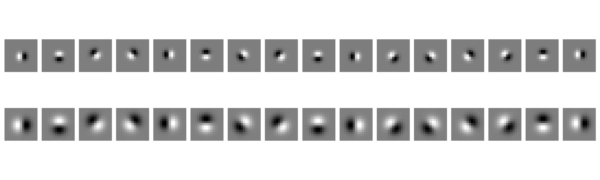
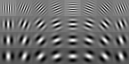
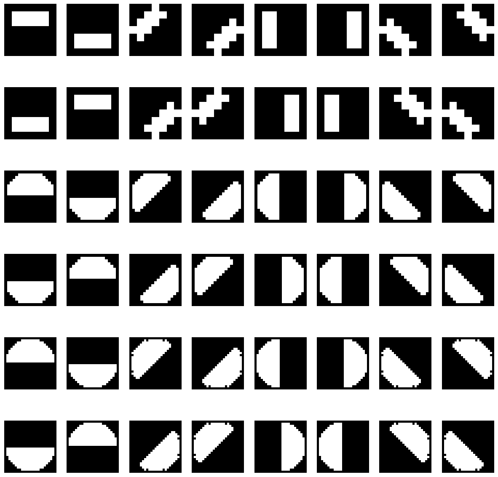
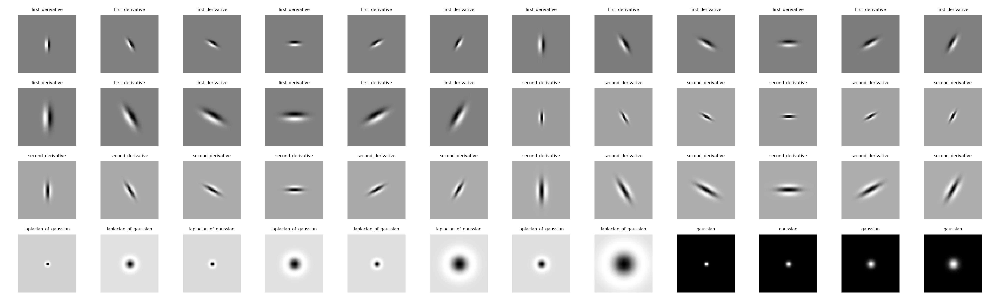

# Probabilistic Boundary Detection and Improving Convolutional Networks

### *RBE549: Computer Vision - [Worcester Polytechnic Institute](https://www.wpi.edu/), Spring 2025*

## Project Overview
This project implements advanced computer vision techniques across two main phases:
1. A probabilistic boundary detection algorithm that improves upon traditional edge detection methods
2. Implementation and optimization of various convolutional neural network architectures

For detailed project specifications, please refer to the [course project page](https://rbe549.github.io/spring2025/hw/hw0/).

## Requirements
- Python 3.8+
- PyTorch
- NumPy
- OpenCV
- scikit-learn
- matplotlib
- tqdm

To install all dependencies:
```bash
pip install -r requirements.txt
```

## Phase 1: Shake My Boundary

### Overview
This phase implements a sophisticated boundary detection algorithm using multiple filter banks and gradient analyses. The approach combines texture, brightness, and color information to create a robust probabilistic boundary detection system.

### Key Features
- Multiple filter bank implementations (DoG, Gabor, HD, LM)
- Multi-channel analysis (texture, brightness, color)
- Gradient computation and combination
- Probabilistic boundary detection

### Steps to Run
1. Ensure your images are in the "BSDS500" directory
2. Run the wrapper script:
```bash
python Wrapper.py
```
All outputs will be automatically saved to the "Outputs" directory.

### Results Visualization

#### Input Image
<p align="left">
  
</p>

#### Generated Filter Banks
<p align="center">
  <table>
    <tr>
      <td>  </td>
      <td>  </td>
      <td>  </td>
      <td>  </td>
    </tr>
    <tr>
      <td align="center">DoG Filters</td>
      <td align="center">Gabor Filters</td>
      <td align="center">HD Masks</td>
      <td align="center">LM Filters</td>
    </tr>
  </table>
</p>

#### Feature Maps and Gradients
<p align="center">
  <table>
    <tr>
      <td>  </td>
      <td>  </td>
      <td>  </td>
    </tr>
    <tr>
      <td align="center">Texton Map</td>
      <td align="center">Brightness Map</td>
      <td align="center">Color Map</td>
    </tr>
  </table>
</p>

#### Comparative Analysis
<p align="center">
  <table>
    <tr>
      <td>  </td>
      <td>  </td>
      <td>  </td>
    </tr>
    <tr>
      <td align="center">Canny Baseline</td>
      <td align="center">Sobel Baseline</td>
      <td align="center">PBLite (Our Method)</td>
    </tr>
  </table>
</p>

## Phase 2: Deep Dive on Deep Learning

### Overview
This phase explores and implements various convolutional neural network architectures, focusing on performance optimization and comparative analysis.

### Supported Architectures
- Baseline CNN
- BatchNorm-enhanced CNN
- ResNet
- ResNeXt
- DenseNet

### Training
```bash
python Train.py --NumEpochs <NUMBER_OF_EPOCHS> \
                --MiniBatchSize <BATCH_SIZE> \
                --ModelType <MODEL_TYPE> \
                --CustomLogs <PATH_TO_CUSTOMLOGS>
```

#### Training Parameters
```
--CheckPointPath      Save directory for model checkpoints (default: ../Checkpoints/)
--NumEpochs          Training epochs (default: 50)
--DivTrain           Train data reduction factor (default: 1)
--MiniBatchSize      Batch size (default: 1)
--LoadCheckPoint     Load from checkpoint? (0/1, default: 0)
--LogsPath           Tensorboard logs directory (default: Logs/)
--ModelType          Architecture selection (Baseline/BatchNorm/ResNet/ResNeXt/DenseNet)
--CustomLogs         Custom logs directory (default: ../Logs)
```

#### Example Training Command
```bash
python Train.py --NumEpochs 50 --MiniBatchSize 32 --ModelType ResNet --CustomLogs ../Logs
```

### Testing
```bash
python Test.py --ModelPath <PATH_TO_CHECKPOINT> \
               --SelectTestSet False \
               --ModelType <MODEL_TYPE>
```

#### Testing Parameters
```
--ModelPath              Checkpoint directory
--LabelsPath            Test labels file (default: ./TxtFiles/LabelsTest.txt)
--SelectTestSet         Choose test set (default: True)
--ModelType             Architecture selection
--ConfusionMatrixPath   Save path for confusion matrix (default: ./Logs)
```

#### Example Testing Command
```bash
python Test.py --ModelPath ../Checkpoints/ResNet/ --ModelType ResNet
```

## Project Structure
```
project-root/
├── BSDS500/            # Dataset directory
├── Checkpoints/        # Model checkpoints
├── Images/             # Result visualizations
├── Logs/              # Training/testing logs
├── Outputs/           # Generated outputs
├── Phase_1_media/     # Phase 1 visualizations
├── Phase 2 media_output/  # Phase 2 results
├── TxtFiles/          # Label and configuration files
├── Train.py           # Training implementation
├── Test.py            # Testing implementation
└── Wrapper.py         # Phase 1 implementation
```

## Citation
If you find this work useful in your research, please consider citing:
```bibtex
@article{WPI_CV_2025,
  title={Probabilistic Boundary Detection and CNN Performance Enhancement},
  author={[Your Name]},
  journal={RBE549 Course Project},
  institution={Worcester Polytechnic Institute},
  year={2025}
}
```

## License
This project is licensed under the MIT License - see the [LICENSE](LICENSE) file for details.
