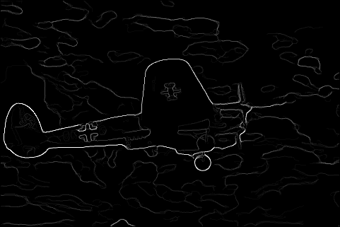

# Probabilistic Boundary Detection and Improving Convolutional Networks

### *RBE549: Computer Vision - [Worcester Polytechnic Institute](https://www.wpi.edu/), Spring 2025*

## Project Guidelines
The project is divided into two phases:
1. Implementation of a probabilistic boundary detection algorithm
2. Implementation and performance improvement of convolutional backbones

Details of the project can be found [here](https://rbe549.github.io/spring2025/hw/hw0/).

## Phase 1: Shake My Boundary

### Overview
Phase 1 involves creating various filter banks and applying them to images for texture, brightness, and color analysis. The primary goal is to generate different maps and gradients for creating a probabilistic boundary detection algorithm.

### Steps to Run the Code
```bash
python Wrapper.py
```
The script reads input images from the "BSDS500" folder and stores all outputs in the "Outputs" folder.

### Results

#### Input Image
<p align="left">
  
</p>

#### Filter Banks Generated
<p align="center">
  <table>
    <tr>
      <td>  </td>
      <td>  </td>
      <td>  </td>
      <td>  </td>
    </tr>
    <tr>
      <td align="center">DoG Filters</td>
      <td align="center">Gabor Filters</td>
      <td align="center">HD Masks</td>
      <td align="center">LM Filters</td>
    </tr>
  </table>
</p>

#### Image Maps
<p align="center">
  <table>
    <tr>
      <td>  </td>
      <td>  </td>
      <td>  </td>
    </tr>
    <tr>
      <td align="center">Texton Map</td>
      <td align="center">Brightness Map</td>
      <td align="center">Color Map</td>
    </tr>
  </table>
</p>

#### Image Gradients
<p align="center">
  <table>
    <tr>
      <td>  </td>
      <td>  </td>
      <td>  </td>
    </tr>
    <tr>
      <td align="center">Texton Gradient</td>
      <td align="center">Brightness Gradient</td>
      <td align="center">Color Gradient</td>
    </tr>
  </table>
</p>

#### Boundary Detection Comparison
<p align="center">
  <table>
    <tr>
      <td>  </td>
      <td>  </td>
      <td>  </td>
    </tr>
    <tr>
      <td align="center">Canny Baseline</td>
      <td align="center">Sobel Baseline</td>
      <td align="center">PBLite</td>
    </tr>
  </table>
</p>

## Phase 2: Deep Dive on Deep Learning

### Overview
This phase focuses on implementing different convolutional backbones and comparing their performance. The primary goal is to implement and improve the performance of these architectures.

### Training the Model

```bash
python Train.py --NumEpochs <NUMBER_OF_EPOCHS> --MiniBatchSize <BATCH_SIZE> --ModelType <MODEL_TYPE> --CustomLogs <PATH_TO_CUSTOMLOGS>
```

#### Arguments
```
optional arguments:
  -h, --help            show this help message and exit
  --CheckPointPath CHECKPOINTPATH
                        Path to save Checkpoints, Default: ../Checkpoints/
  --NumEpochs NUMEPOCHS
                        Number of Epochs to Train for, Default:50
  --DivTrain DIVTRAIN   Factor to reduce Train data by per epoch, Default:1
  --MiniBatchSize MINIBATCHSIZE
                        Size of the MiniBatch to use, Default:1
  --LoadCheckPoint LOADCHECKPOINT
                        Load Model from latest Checkpoint from CheckPointsPath?, Default:0
  --LogsPath LOGSPATH   Path to save Logs for Tensorboard, Default=Logs/
  --ModelType MODELTYPE
                        Model to use for training Model Types are Baseline, BatchNorm, ResNet, ResNeXt, DenseNet, Default:Baseline
  --CustomLogs CUSTOMLOGS
                        Path to save Logs and dynamic plots, Default=../Logs
```

#### Example
```bash
python Train.py --NumEpochs 50 --MiniBatchSize 32 --ModelType Baseline --CustomLogs ../Logs
```

### Testing the Model

```bash
python Test.py --ModelPath <PATH_TO_CHECKPOINT> --SelectTestSet False --ModelType Baseline
```

#### Arguments
```
optional arguments:
  -h, --help            show this help message and exit
  --ModelPath MODELPATH
                        Path to load latest model from, Default:ModelPath
  --LabelsPath LABELSPATH
                        Path of labels file, Default:./TxtFiles/LabelsTest.txt
  --SelectTestSet SELECTTESTSET
                        Choose the set to run the test on, Default:True
  --ModelType MODELTYPE
                        Model to use for training Model Types are Baseline, BatchNorm, ResNet, ResNeXt, DenseNet, Default:Baseline
  --ConfusionMatrixPath CONFUSIONMATRIXPATH
                        Path to save the confusion matrix Default:./Logs
```

#### Example
```bash
python Test.py --ModelPath ../Checkpoints/Baseline/ --ModelType Baseline
```

## Project Structure
```
├── Alohomora-Probability-based-Edge-Detection-master/
│   ├── Images/
│   ├── Phase_1_media/
│   └── Phase 2 media_output/
├── BSDS500/            # Input images
├── Outputs/            # Generated outputs
├── Checkpoints/        # Model checkpoints
├── Logs/              # Training and testing logs
├── TxtFiles/          # Label files
├── Train.py           # Training script
├── Test.py            # Testing script
└── Wrapper.py         # Phase 1 implementation
```
